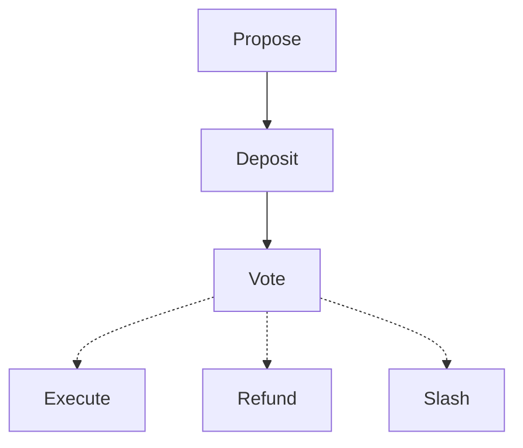

# Governance

**TODO:** Remove 'target' from instantiate msg an update this README.

This is a base implementation of governance contract for Harbor Protocol . The contract can be extended to be used by other protocol with relatively same proposal execution behaviour.

The contract uses the binding from package/bindings in the root directory to interact with Comdex Native Modules for Queries and Messages.

## Instantiate Operation

Instantiation governance contract requires the locking contract address.
Thus, it is advised that the user first instantiate a locking contract and then
instantiate this contract.

```rust
pub struct InstantiateMsg {
    pub threshold: Threshold,
    pub locking_contract: Addr,
    pub target: String,
}
```

* `threshold` -  Specifies the requirements for passing a proposal. This contract
only supports [ThresholdQuorum](/packages/utils/src/threshold.rs) as of now.
Quorum threshold requires two values: *threshold* and *quorum*. The former
represents the percent of votes needed to pass the proposal and the latter
represents the percent of total voting power that needs to vote for the proposal
to pass. For example, if quorum = 50% and threshold = 30% and the total voting
power is 2000, then if the voting power of all the votes is less than 1000, the
proposal won't pass, even if all voted *yes*.
* `locking_contract` - Address of the locking contract.

## Execute Operations

There are a total of 6 execution calls that are available.

1. Propose
2. Vote
3. Execute
4. Refund
5. Deposit
6. Slash

The correct order of execution is as follows:



### Propose

```rust
Propose { propose: Propose },
```

This is used to raise a new proposal. At any instance, only a single proposal
may be active and raising another will result in an error.

```rust
pub struct Propose {
    pub title: String,
    pub description: String,
    pub msgs: Vec<ComdexMessages>,
    pub latest: Option<Expiration>,
    pub app_id_param: u64,
}
```

* `title` - Specifies the title of the proposal.
* `description` - The body of the proposal with any details for the voter.
* `msgs` - The msg for implementing the proposal requirement. For example,
whitelisting an asset, etc.
* `latest` - Specifies the proposal voting period before expiration.
* `app_id_param` - application ID for which to raise this proposal.

### Vote

```rust
Vote { proposal_id: u64, vote: Vote },
```

Used to vote on an active proposal.

* `proposal_id` - Used to specify the proposal ID that will be voted.
* `vote` - Vote on the proposal with one of the four possible choices: *Yes*, *No*, *Abstain*, *Veto*.

### Execute

```rust
Execute { proposal_id: u64 },
```

This is used when the proposal has successfully passed, i.e. fulfilled the
threshold requirements. Cannot be executed if the proposal did not pass or was
vetoed.

### Refund

```rust
Refund { proposal_id: u64 },
```

This is used when the proposal failed to meet the threshold. Furthermore, can
only be called if the proposal was not vetoed. All deposited tokens are refunded.

### Deposit

```rust
Deposit { proposal_id: u64 },
```

Deposits the governance token to the proposal. Deposits are only allowed until
the minimum deposit threshold is not met. All proposals require a minimum deposit
before voting may begin.

### Slash

```rust
Slash { proposal_id: u64 },
```

When the proposal was voted by majority, then the deposits are burnt rather
than refunding.

## Query Operations

The following queries are available in this contract.

1. Threshold
2. Proposal
3. ListProposals
4. ReverseProposals
5. Vote
6. ListVotes
7. ListAppProposal
8. AppAllUpData
9. Supply
10. TotalVTokens

The final two queries are implemented and documented in the locking contract
source code.

### Threshold

```rust
Threshold {
    proposal_id: u64,
}
```

Queries the current threshold settings.

* `proposal_id` - Unique proposal ID for which to request the threshold value. This
is needed because the response contains the total weight of the votes for an
indivisual proposal.

RESPONSE:

```rust
ThresholdResponse::ThresholdQuorum {
    threshold,
    quorum,
    total_weight,
}
```

* `threshold` - Minimum weight of votes needed to pass a proposal, that is, the
proportion of *quorum*.
* `quorum` - Minimum weight of votes that need to participate in voting, irrespective
of the choice of votes.
* `total_weight` - Total weight of votes that have voted on the proposal.

### Proposal

```rust
Proposal {
    proposal_id: u64,
}
```

Queries the proposal details.

* `proposal_id` - Unique ID of the proposal for which to request the details.

RESPONSE:

```rust
ProposalResponseTotal {
    pub id: u64,
    pub title: String,
    pub start_time: Timestamp,
    pub description: String,
    pub start_height: u64,
    pub expires: Expiration,
    pub msgs: Vec<ComdexMessages>,
    pub status: Status,
    pub duration: Duration,
    /// pass requirements
    pub threshold: Threshold,
    // the total weight when the proposal started (used to calculate percentages)
    pub total_weight: u128,
    // summary of existing votes
    pub votes: Votes,
    pub proposer: String,
    pub token_denom: String,
    pub current_deposit: u128,
}
```

* `id` - Unique identifier for the proposal.
* `title` - Title of the proposal.
* `start_time` - Timestamp at which the proposal was raised.
* `description` - Body of the proposal.
* `start_height` - Block height at which proposal was raised.
* `expires` - Expiration time of the proposal. May be less than or equal to the
max voting period.
* `msgs` - Comdex Message which will be forwarded to the chain to implement the
proposal changes.
* `status` - Current status of the proposal.
For example, Open, Pending, etc.
* `duration` - Duration for which the proposal will be valid for voting.
* `threshold` - Minimum weight of votes for passing.
* `total_weight` - Current total weight of the votes.
* `votes` - Weight of each vote option, i.e. total vote for each *yes*, *no*,
*abstain* and *veto*.
* `proposer` - Address of the user who raised this proposal.
* `token_denom` - Denomination of the governance token.
* `current_deposit` - Current governance token deposited for this proposal.

### ListProposals

```rust
ListProposals {
    start_after: Option<u64>,
    limit: Option<u32>,
}
```

Paginated query to list all past and present proposals.

* `start_after` - Starting ID of the proposal.
* `limit` - Number of proposals to return in the response.

**NOTE:** The default limit is **100** and the maximum limit is **300**.

RESPONSE:

The reponse contains an array of the following details.

```rust
ProposalResponse {
    pub id: u64,
    pub title: String,
    pub description: String,
    pub msgs: Vec<ComdexMessages>,
    pub status: Status,
    pub expires: Expiration,
    pub threshold: ThresholdResponse,
}
```

* `id` - Unique ID of the proposal.
* `title` - Title of the proposal.
* `description` - Description of the proposal.
* `msgs` - Comdex Message which will be forwarded to the chain to implement the
proposal changes.
* `status` - Current status of the proposal state.
* `expires` - Expiration time of the proposal. May be less than or equal to the
max voting period.
* `threshold` - Refer [here](#threshold) for details.

### ReverseProposals

```rust
ReverseProposals {
    start_before: Option<u64>,
    limit: Option<u32>,
}
```

Paginated query to list all past and present proposals in reverse order.

* `start_before` - Ending proposal ID, i.e. list all proposals before this proposal.
* `limit` - Number of proposals to return in the response.

**NOTE:** The default limit is **100** and the maximum limit is **300**.

RESPONSE is same as the [previous](#listproposals) query.

### Vote {#query-vote}

```rust
Vote {
    proposal_id: u64,
    voter: String,
}
```

Queries the vote details for a specific voter and proposal.

* `proposal_id` - Unique proposal ID.
* `voter` - Address of the user.

RESPONSE:

```rust
pub struct VoteInfo {
    pub proposal_id: u64,
    pub voter: String,
    pub vote: Vote,
    pub weight: u128,
}
```

* `proposal_id` - Unique proposal ID.
* `voter` - Address of the voter.
* `vote` - Choice of vote, i.e. *yes*, *no*, *abstain* or *veto*.
* `weight` - Weight of vote.

### ListVotes

```rust
ListVotes {
    proposal_id: u64,
    start_after: Option<String>,
    limit: Option<u32>,
}
```

Queries all the votes for the specified proposal. This query also implements
pagination.

* `proposal_id` - Unique proposal ID.
* `start_after` - Starting proposal ID for pagination.
* `limit` - Number of votes to return in response.

**NOTE:** The default limit is **100** and the maximum limit is **300**.

RESPONSE:

The response of this query is an array of vote info. Refer to the [previous](#query-vote)
query's response.

### ListAppProposal

```rust
ListAppProposal {
    app_id: u64,
    start_after: u32,
    limit: Option<u32>,
    status: Option<Status>,
},
```

Queries all proposals raised for a specific application. This query also implements
pagination.

* `app_id` - Unique application ID.
* `start_after` - Starting proposal ID for pagination.
* `limit` - Number of proposals to return in response.
* `status` - Constrains the returned response to only contain the proposals
matching the specified status. For example, *passed*, *rejected*, etc.

RESPONSE:

```rust
AppProposalResponse {
    proposals: Vec<ProposalResponseTotal>,
    proposal_count: u64,
}
```

The response of this query is an array of proposal details. Refer to [Proposal](#proposal)
query's response. It additionally returns a count of number of proposals in the response.

### AppAllUpData

```rust
AppAllUpData {
    app_id: u64,
}
```

Queries the total governance token weight for the application and the total
participation for all the proposals.

* `app_id` - Unique application ID.

RESPONSE:

```rust
AppGovConfig {
    pub proposal_count: u64,
    pub current_supply: u128,
    pub active_participation_supply: u128,
}
```

* `proposal_count` - Count of proposals for the application.
* `current_supply` - Total supply of the governance token.
* `active_participation_supply` - Total weight of the participated votes.
