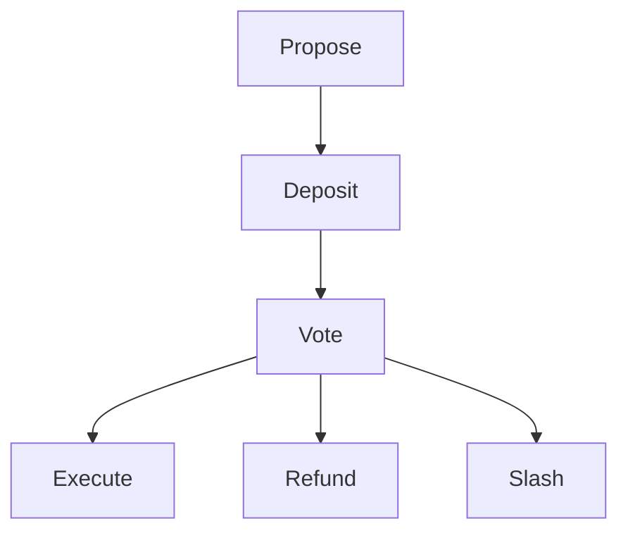

# Governance

**TODO:** Remove 'target' from instantiate msg an update this README.

This is a base implementation of governance contract for Harbor Protocol . The contract can be extended to be used by other protocol with relatively same proposal execution behaviour.

The contract uses the binding from package/bindings in the root directory to interact with Comdex Native Modules for Queries and Messages.

## Instantiate Operation

Instantiation governance contract requires the locking contract address.
Thus, it is advised that the user first instantiate a locking contract and then
instantiate this contract.

```rust
pub struct InstantiateMsg {
    pub threshold: Threshold,
    pub locking_contract: Addr,
    pub target: String,
}
```

* `threshold` -  Specifies the requirements for passing a proposal. This contract
only supports [ThresholdQuorum](/packages/utils/src/threshold.rs) as of now.
Quorum threshold requires two values: *threshold* and *quorum*. The former
represents the percent of votes needed to pass the proposal and the latter
represents the percent of total voting power that needs to vote for the proposal
to pass. For example, if quorum = 50% and threshold = 30% and the total voting
power is 2000, then if the voting power of all the votes is less than 1000, the
proposal won't pass, even if all voted *yes*.
* `locking_contract` - Address of the locking contract.

## Execute Operations

There are a total of 6 execution calls that are available.

1. Propose
2. Vote
3. Execute
4. Refund
5. Deposit
6. Slash

The correct order of execution is as follows:



### Propose

```rust
Propose { propose: Propose },
```

This is used to raise a new proposal. At any instance, only a single proposal
may be active and raising another will result in an error.

```rust
pub struct Propose {
    pub title: String,
    pub description: String,
    pub msgs: Vec<ComdexMessages>,
    pub latest: Option<Expiration>,
    pub app_id_param: u64,
}
```

* `title` - Specifies the title of the proposal.
* `description` - The body of the proposal with any details for the voter.
* `msgs` - The msg for implementing the proposal requirement. For example,
whitelisting an asset, etc.
* `latest` - Specifies the proposal voting period before expiration.
* `app_id_param` - application ID for which to raise this proposal.

### Vote

```rust
Vote { proposal_id: u64, vote: Vote },
```

Used to vote on an active proposal.

* `proposal_id` - Used to specify the proposal ID that will be voted.
* `vote` - Vote on the proposal with one of the four possible choices: *Yes*, *No*, *Abstain*, *Veto*.

### Execute

```rust
Execute { proposal_id: u64 },
```

This is used when the proposal has successfully passed, i.e. fulfilled the
threshold requirements. Cannot be executed if the proposal did not pass or was
vetoed.

### Refund

```rust
Refund { proposal_id: u64 },
```

This is used when the proposal failed to meet the threshold. Furthermore, can
only be called if the proposal was not vetoed. All deposited tokens are refunded.

### Deposit

```rust
Deposit { proposal_id: u64 },
```

Deposits the governance token to the proposal. Deposits are only allowed until
the minimum deposit threshold is not met. All proposals require a minimum deposit
before voting may begin.

### Slash

```rust
Slash { proposal_id: u64 },
```

When the proposal was voted by majority, then the deposits are burnt rather
than refunding.

## Query Operations
